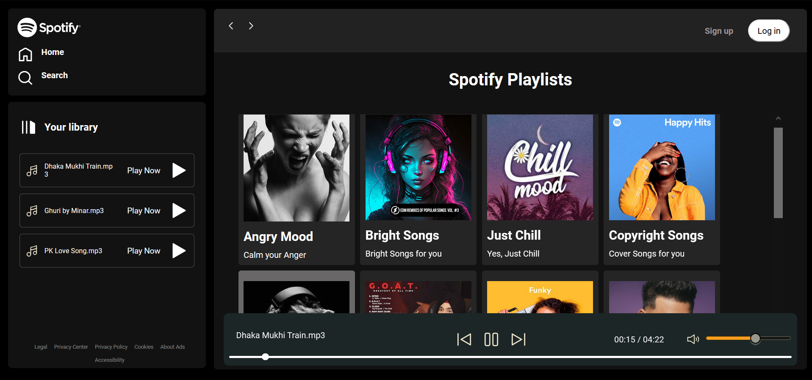

# Spotify-Clone

This is a clone of spotify, famous music app.

## Table of contents

- [Overview](#overview)
    - [Requirement](#project-requirement)
    - [Solution Screenshot](#solution-screenshot)
    - [Links](#links)
- [Built with](#built-with)
- [Author](#author)

### Project-Requirement

A clone of spotify, should be similar in design and functionality.

### Solution Screenshot

The final output:

### Links

#### You will not be able to see the music albums and songs in the online version because I did not host those files :) . I will store those audio files in hosting service later. You can see the screenshot of the app of local version above. Sorry :)

Live Site URL Github:[See live app here](https://mainul-islam-nirob.github.io/spotify/)
Live Site URL Github:[See live app here](https://spotify-nirob.netlify.app/)

### Built with

- HTML
- Tailwind CSS
- Javascript

## Author

- Website - Well I haven't made my profile portfolio yet, gonna make it sooon when I know a lot of stuffs
- LinkedIn - [@mainul islam](https://www.linkedin.com/in/mainul-islam-nirob/)
- Frontend Mentor - [@mainul](https://www.frontendmentor.io/profile/Mainul-Islam-Nirob)
- Twitter - [@mainul](https://twitter.com/Mainuli96601040)
- FreeCodeCamp - [@mainul](https://www.freecodecamp.org/mainul)
